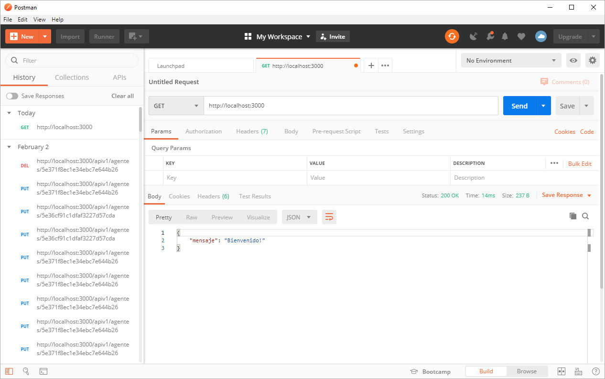
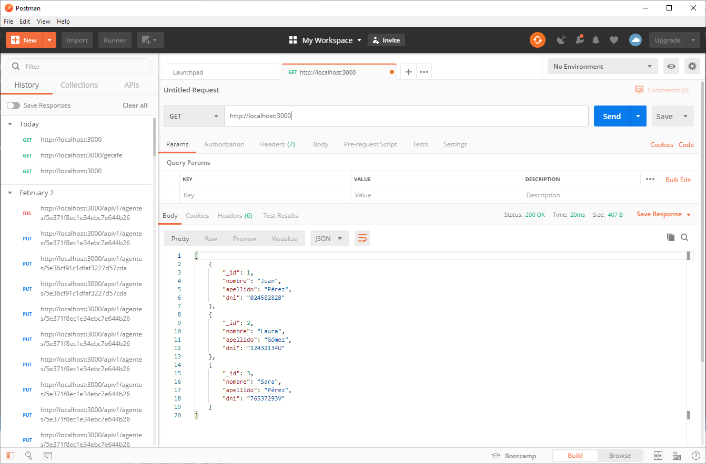
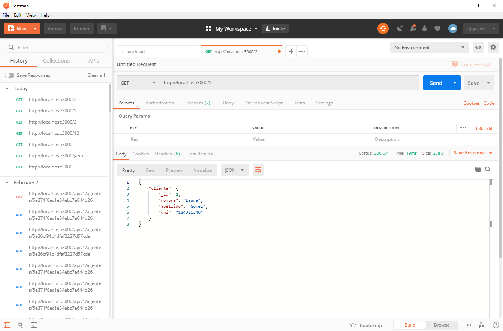
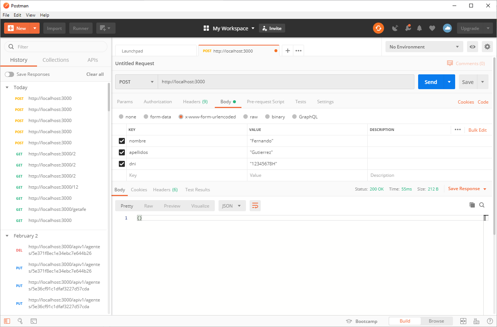
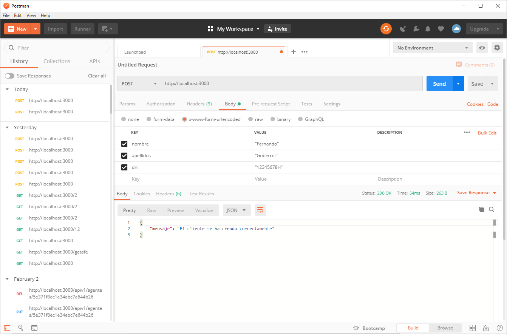
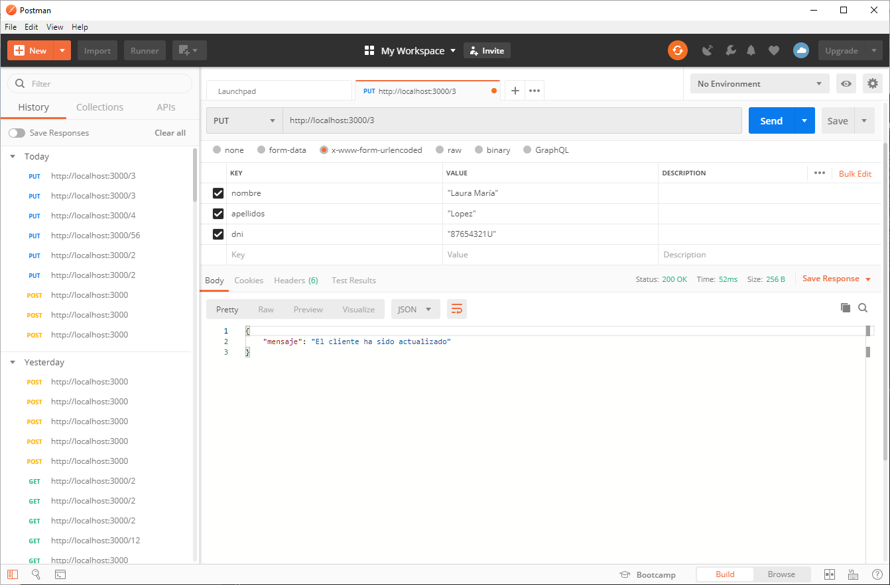
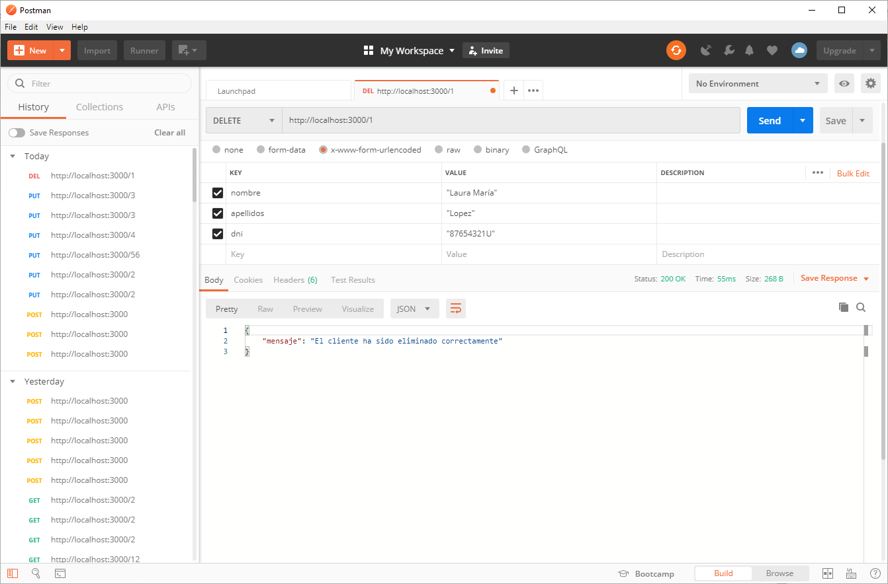

# 12 Node


Desde la terminal escribo 

```
PS C:\Users\manana\Documents\apiexpress> npm init
This utility will walk you through creating a package.json file.
It only covers the most common items, and tries to guess sensible defaults.

See `npm help json` for definitive documentation on these fields
and exactly what they do.

Use `npm install <pkg>` afterwards to install a package and
save it as a dependency in the package.json file.

Press ^C at any time to quit.
package name: (apiexpress)
version: (1.0.0)
description:
entry point: (index.js) app.js
test command:
git repository:
keywords:
author:
license: (ISC)
About to write to C:\Users\manana\Documents\apiexpress\package.json:

{
  "name": "apiexpress",
  "version": "1.0.0",
  "description": "",
  "main": "app.js",
  "scripts": {
    "test": "echo \"Error: no test specified\" && exit 1"
  },
  "author": "",
  "license": "ISC"
}

Is this OK? (yes)
PS C:\Users\manana\Documents\apiexpress>
```

PS C:\Users\manana\Documents\apiexpress> npm  i nodemon --save

PS C:\Users\manana\Documents\apiexpress> npm i express --save


Archivo Package.json con dependencias:

```sh
{
  "name": "apiexpress",
  "version": "1.0.0",
  "description": "",
  "main": "app.js",
  "scripts": {
    "test": "echo \"Error: no test specified\" && exit 1"
  },
  "author": "",
  "license": "ISC",
  "dependencies": {
    "express": "^4.17.1",
    "nodemon": "^2.0.2"
  }
}

```


Archivo app.js

```sh
const express = require('express');
const app = express(); //Toda la coleccione de métodos de la libreria express

app.listen(3000, () => {
    console.log("App esta escuchando en http://localhost:3000")
});

```

Levanto mi servidor:

```sh
PS C:\Users\manana\Documents\apiexpress> node app
App esta escuchando en http://localhost:3000

```

Usando Nodemon

En el Package añado:

```
"scripts": {
    "start" : "nodemon app",
    "test": "echo \"Error: no test specified\" && exit 1"
  },
```

Son Scrips que lanzo mi aplicación

Para ejecutar la aplicación `npm run start`

```
PS C:\Users\manana\Documents\apiexpress> npm run start

> apiexpress@1.0.0 start C:\Users\manana\Documents\apiexpress
> nodemon app

[nodemon] 2.0.2
[nodemon] to restart at any time, enter `rs`
[nodemon] watching dir(s): *.*
[nodemon] watching extensions: js,mjs,json
[nodemon] starting `node app.js`
App esta escuchando en http://localhost:3000

```

Esto me permite que los cambios que haga en mi proyecto los detecte automaticamente. Si lanzo directamente `nodemon app` hace lo mismo 
pero en windows hay lios que es un poco complicado detectar, por eso lo metemos en los scripts.

Si en Chrome llamo:

```sh
http://localhost:3000/

Cannot GET /
```
Esto indica que mi servidor esta levantado.

## GET

Petición GET con express:

```js
//Peticiones get
// localhost:3000/ seran peticiones get que gestiono con un callback
app.get('/', (req, res)=> {
  res.status(200).json({"mensaje": "Bienvenido!"}); //Codigo de respuesta de la operación - json mete en el body el json
}); 

app.get('/getafe', (req, res)=> {
    res.status(200).json({"mensaje": "Mensaje desde Getafe!"}); //Codigo de respuesta de la operación - json mete en el body el json
});
```

Al cargar en 

Si en Chrome llamo:

```sh
http://localhost:3000/
// 20200219125203
// http://localhost:3000/

{
  "mensaje": "Bienvenido!"
}
```
Si en Chrome llamo:
```sh
http://localhost:3000/getafe
// 20200219125354
// http://localhost:3000/getafe

{
  "mensaje": "Mensaje desde Getafe!"
}

```
Para documentar librerías:


[https://swagger.io/](https://swagger.io/)




```sh
const express = require('express');
const app = express(); //Toda la coleccione de métodos de la libreria express

let clientes = [
   {
       _id: 1,
       nombre: "Juan",
       apellido: "Pérez",
       dni: "02458282B"
   },
   {
       _id: 2,
       nombre: "Laura",
       apellido: "Gómez",
       dni: "12432134U"
   },
   {
       _id: 3,
       nombre: "Sara",
       apellido: "Pérez",
       dni: "76537293V"
   }
];

//Peticiones get
// localhost:3000/ seran peticiones get que gestiono con un callback
app.get('/', (req, res)=> {
  res.status(200).json(clientes); //Codigo de respuesta de la operación - json mete en el body el json
}); 


app.listen(3000, () => {
    console.log("App esta escuchando en http://localhost:3000")
});
```

`.json` es como un stringfy lo parsea para convertirlo de Objetos a JSON (pone las comillas en las keys)




Get con parámetros:

```
// Paso de parámetros
app.get('/:_id', (req, res)=> {
    console.log(req.params._id);
    res.status(200).json({});
})
```

Llamo mi URL con parámetro:

```
http://localhost:3000/12
```
En la terminal sale 12.

Sabe que es un parámetro por que despues de '/' hay ':'.

Regresar el que le pida
```
// Paso de parámetros
app.get('/:_id', (req, res)=> {
    console.log(req.params._id);

    let cliente = clientes.find(cliente => {
        return cliente._id === Number(req.params._id);
    });
    res.status(200).json({cliente});
})
```



## POST

```
// POST
app.post('/', (req, res)=>{
    console.log(req.body);
    res.status(200).json({});
    
})
```

```
// POST
//Body-Parser me sirve para que en las entradas me parse el JSON si no sale 
// me pone undefined
app.post('/', (req, res)=>{
    console.log(req.body);
    res.status(200).json({});

})

[nodemon] restarting due to changes...
[nodemon] starting `node app.js`
App esta escuchando en http://localhost:3000
undefined
```

## Body Parser

`PS C:\Users\manana\Documents\apiexpress> npm i body-parser --save`

Instalo Body Parser


Una vez instalado lo puedo usar:

```
const bodyParser = require('body-parser');

app.use(bodyParser.urlencoded({ extended: true}));

```


Una vez que ya lo tiende y si vuelvo a cargar el URL:



```
[nodemon] restarting due to changes...
[nodemon] starting `node app.js`
App esta escuchando en http://localhost:3000
{ nombre: '"Fernando"', apellidos: '"Gutierrez"', dni: '"12345678H"' }
```

Ahora ya me sale bien en consola.

Vamos a meter el cliente que mandemos con post a nuestro array:

```sh
app.post('/', (req, res)=>{
    console.log(req.body);    
    let cliente = req.body;
    cliente._id = clientes[clientes.length-1]._id + 1; 
    clientes.push(cliente);

    res.status(200).json({
        mensaje: "El cliente se ha creado correctamente"
    });
    console.log(clientes);
})

```





En la consola nos muestra esto:
```sh
App esta escuchando en http://localhost:3000
{ nombre: '"Fernando"', apellidos: '"Gutierrez"', dni: '"12345678H"' }
[
  { _id: 1, nombre: 'Juan', apellido: 'Pérez', dni: '02458282B' },
  { _id: 2, nombre: 'Laura', apellido: 'Gómez', dni: '12432134U' },
  { _id: 3, nombre: 'Sara', apellido: 'Pérez', dni: '76537293V' },
  {
    nombre: '"Fernando"',
    apellidos: '"Gutierrez"',
    dni: '"12345678H"',
    _id: 4
  }
]
{ nombre: '"Laura"', apellidos: '"Lopez"', dni: '"87654321U"' }
[
  { _id: 1, nombre: 'Juan', apellido: 'Pérez', dni: '02458282B' },
  { _id: 2, nombre: 'Laura', apellido: 'Gómez', dni: '12432134U' },
  { _id: 3, nombre: 'Sara', apellido: 'Pérez', dni: '76537293V' },
  {
    nombre: '"Fernando"',
    apellidos: '"Gutierrez"',
    dni: '"12345678H"',
    _id: 4
  },
  {
    nombre: '"Laura"',
    apellidos: '"Lopez"',
    dni: '"87654321U"',
    _id: 5
  }
]

```


## Método `put` (Actualizar Registros)

```
//Actualizar registros
app.put('/:_id', (req, res) => {
   let posicion = clientes.findIndex(cliente => {
       return cliente._id === Number(req.params._id);
    })
    console.log(posicion);
    res.status(200).json({});
});

```


En la consola me sale
```sh
[nodemon] restarting due to changes...
[nodemon] starting `node app.js`
App esta escuchando en http://localhost:3000
1

```
Si mando uno que no existe me pone `-1`
```sh
PUT http://localhost:3000/56
...
-1
```

Manejando los diferentes casos en el Put


```sh
//Actualizar registros
app.put('/:_id', (req, res) => {
   let posicion = clientes.findIndex(cliente => {
       return cliente._id === Number(req.params._id);
    });
    if(posicion < 0) {
        res.status(200).json({
            mensaje: "El cliente no existe"
        })
    } else {
        if(req.body.nombre !== undefined){
            clientes[posicion].nombre = req.body.nombre;
        }
        if(req.body.apellidos !== undefined){
            clientes[posicion].apellidos = req.body.apellidos;
        }
        if(req.body.dni !== undefined){
            clientes[posicion].dni = req.body.dni;
        }
        res.status(200).json({
            mensaje: "El cliente ha sido actualizado"
        })
    }
    console.log(clientes);
});
```



En la consola tenemos:

```sh
[
  { _id: 1, nombre: 'Juan', apellido: 'Pérez', dni: '02458282B' },
  { _id: 2, nombre: 'Laura', apellido: 'Gómez', dni: '12432134U' },
  {
    _id: 3,
    nombre: '"Laura María"',
    apellido: 'Pérez',
    dni: '"87654321U"',
    apellidos: '"Lopez"'
  }
]
```

## Método `delete`


```sh
app.delete('/:_id', (req, res) => {
    let posicion = clientes.findIndex(cliente => {
        return cliente._id === Number(req.params._id);
    });
    if(posicion < 0) {
        res.status(200).json({ mensaje: "El cliente no existe"});
    } else {
        clientes.splice(posicion, 1); //Borra en el array
        res.status(200).json({
            mensaje: "El cliente ha sido eliminado correctamente"
        })
    }
    console.log(clientes);
})
```

En la consola nos sale:

```sh
[nodemon] restarting due to changes...
[nodemon] starting `node app.js`
App esta escuchando en http://localhost:3000
[
  { _id: 2, nombre: 'Laura', apellido: 'Gómez', dni: '12432134U' },
  { _id: 3, nombre: 'Sara', apellido: 'Pérez', dni: '76537293V' }
]

```


